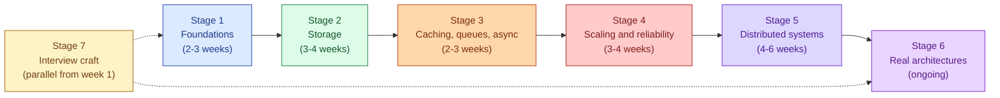

<link rel="stylesheet" href="/assets/css/practice.css">

<section class="pr-hero">
  

    System Design Roadmap
    <h1 class="pr-title">From "I have no idea where to start" to "I just designed Instagram on a whiteboard"</h1>
    

      A staged learning path. Each stage builds on the one before it. Start at the top, work down. Do not try to learn everything at once.
    

  

</section>

## How to use this roadmap

System design has a real learning order. Most people fail at it not because they are missing some exotic concept, but because they skipped the basics. They study Paxos before they understand replication. They argue about CRDTs without knowing what a cache stampede looks like.

This roadmap fixes that. Seven stages, ordered so that every concept rests on the previous ones. By the end you can sit down for any senior-level system design interview, draw the architecture in twenty minutes, and answer the follow-ups without panic.

A few rules:

- **Do not skip stages.** If you do not know what TCP is, do not start with Kafka. The roadmap is sequenced for a reason.
- **Build something at each stage.** Reading is not enough. Pick one tiny project per stage. Two hundred lines of code beats two hundred pages of theory.
- **You will revisit early stages.** That is the point. Each new stage gives you a better mental model for the basics. Re-read Stage 1 after Stage 4. It will read differently.

## The journey, at a glance

Total: roughly four to six months of focused study, two to four hours per day. Faster if you already write production code. Slower if this is your first time thinking about distributed systems.

---

## Stage 1: Foundations

**What this stage is.** The vocabulary. Before you can design anything, you need to know what a network is, what a server actually does, how a request reaches it, and what makes systems slow or unreliable. Most "system design" questions are really questions about these basics, dressed up.

**Topics:**

- **The client-server model.** What a server is, what a client is, what a port is, why we call it a "service".
- **HTTP, end to end.** Request methods, status codes, headers, what `Content-Type` actually does, what a redirect is, what `Cache-Control` controls.
- **TCP vs UDP.** Why one is reliable and slow, why the other is fast and lossy, when to pick each. The three-way handshake.
- **TLS in one paragraph.** What an HTTPS handshake does, what a certificate is, why TLS termination matters for performance.
- **DNS.** How a domain name turns into an IP address. What an `A` record is, what a `CNAME` is, what TTL means for DNS.
- **Latency vs throughput.** A 50ms request and a system that handles 50,000 requests per second are two completely different problems. Understand which you have.
- **Latency numbers everyone should know.** L1 cache 1ns, memory 100ns, disk 10ms, cross-region network 100ms. These ratios shape every design decision.
- **The four nines.** What 99%, 99.9%, 99.99% mean in minutes per year of downtime. Why 99% is terrible for anything serious.
- **Synchronous vs asynchronous.** What it means to "block on a call", what callbacks and event loops are, what happens when one slow downstream service ruins your latency.
- **API styles.** REST, RPC, gRPC, GraphQL, WebSocket. When each fits.

**By the end of this stage you can:** read a basic architecture diagram (client, load balancer, server, database) and explain what every arrow is doing.

---

## Stage 2: Storage and data

**What this stage is.** Where the data lives. The single biggest decision in any system design is how you store and access data. Most failures and most cost happen here. Spend real time on this stage.

**Topics:**

- **SQL databases.** Tables, rows, columns. Primary keys, foreign keys, joins. Why a JOIN can be cheap or catastrophic depending on indexes.
- **Indexes.** B-tree indexes, hash indexes, composite indexes. What "index covers the query" means. Why every WHERE clause needs to be thought about.
- **Transactions and ACID.** Atomic, consistent, isolated, durable. What each word actually means in practice. What happens when you do not have ACID (the answer is: weird things, sometimes silently).
- **Isolation levels.** Read uncommitted, read committed, repeatable read, serializable. What anomalies each one allows. Why most production systems use read committed without realizing it.
- **NoSQL families.**
  - Key-value (Redis, DynamoDB)
  - Document (MongoDB)
  - Wide-column (Cassandra, ScyllaDB)
  - Graph (Neo4j)
  - Search (Elasticsearch, OpenSearch)
- **When NoSQL is the right answer and when it is not.** It is rarely about scale. It is usually about access patterns.
- **Normalization vs denormalization.** Why textbook normalization breaks down at scale. Why most real systems store the same data in three places.
- **Replication.**
  - Leader-follower (the common case)
  - Multi-leader (rare, painful)
  - Replication lag, and why it matters
- **Sharding.**
  - Range sharding, hash sharding, geographic sharding
  - The hot shard problem
  - Re-sharding (the operational nightmare)
- **CAP and the truth about it.** What it actually says (and what most blog posts get wrong).
- **Consistency models.**
  - Strong consistency
  - Eventual consistency
  - Read-your-writes
  - Monotonic reads
  - Causal consistency
- **Storage engines, briefly.** B-trees vs LSM trees. Why your database choice changes write performance by 10x.
- **Backups, snapshots, point-in-time recovery.** What "data loss" means in different failure modes.

**By the end of this stage you can:** pick a database for a given product and defend the choice. Read a `EXPLAIN` plan and explain what is slow. Sketch a sharded schema for a 100M-row table.

---

## Stage 3: Caching, queues, and async work

**What this stage is.** Making things fast and decoupled. A direct read from a database is sometimes the right answer, but often it is not. This stage covers the layers and the in-between components that hold a real system together.

**Topics:**

- **What a cache is, really.** A faster, smaller, less authoritative copy of some data. Every level of the stack has caches: CPU, OS, disk, application, CDN, browser.
- **Where caches live.**
  - Browser
  - CDN
  - In-process (a hashmap in your app)
  - Distributed (Redis, Memcached)
  - Database query cache
- **Cache strategies.** Read-through, write-through, write-behind, write-around, cache-aside. When each fits.
- **Eviction policies.** LRU, LFU, FIFO. Why your cache hit rate depends on this more than on size.
- **Cache invalidation.** "There are only two hard things in computer science." Patterns: TTL, explicit invalidation, write-through, pub/sub invalidation.
- **The thundering herd / cache stampede problem.** What happens when a popular key expires and 10,000 requests all miss at once. Defenses: jittered TTLs, request coalescing, stale-while-revalidate.
- **Hot keys.** When one key takes 100,000 reads per second and the rest of the cache is bored. Layered defense: CDN, in-process, replica fan-out.
- **CDNs.** What gets cached at the edge, what does not. Why HTTP caching headers exist. What "cache key" means.
- **Message queues vs streams.**
  - Queue: each message goes to one consumer (SQS, RabbitMQ).
  - Stream: each message can be read by many consumers (Kafka, Kinesis).
- **Delivery guarantees.** At-most-once, at-least-once, exactly-once. The last one is harder than it sounds. Most "exactly-once" systems are actually "at-least-once with idempotent consumers".
- **Idempotency.** What it means, how to design idempotent endpoints, what an idempotency key buys you.
- **The outbox pattern.** How to publish an event reliably when your database write succeeds. The single most useful pattern in event-driven systems.
- **CDC (change data capture).** How tools like Debezium turn database changes into streams.
- **Backpressure.** What happens when producers are faster than consumers. Strategies: drop, slow down, buffer to disk.
- **Dead letter queues.** What to do with messages that just refuse to process.

**By the end of this stage you can:** draw a system where a write goes to a database, an event is published to Kafka, and three downstream services react to it without the original write knowing or caring.

---

## Stage 4: Scaling and reliability

**What this stage is.** How a system survives growth and survives failure. Scaling and reliability are the same conversation: a system that cannot scale will fall over under load, and a system that cannot handle failure will fall over for unrelated reasons.

**Topics:**

- **Vertical vs horizontal scaling.** Bigger box vs more boxes. When each is right. Why "just buy a bigger server" is a real option for a surprising number of products.
- **Stateless vs stateful services.** Why stateless services are easy to scale. Why the database is the hard part.
- **Load balancers.**
  - L4 (TCP-level) vs L7 (HTTP-level)
  - Algorithms: round-robin, least-connections, IP-hash, consistent-hash
  - Health checks: passive, active, hybrid
  - TLS termination at the LB
- **Auto-scaling.** When to add a box. When to remove one. The scale-up vs scale-down asymmetry. Why scaling down is harder than scaling up.
- **Connection pooling.** Why every service that talks to a database needs one. What happens without it (you will see).
- **Rate limiting.**
  - Token bucket, leaky bucket, sliding window
  - Where to enforce (gateway, service, both)
  - Per-user, per-IP, per-endpoint
- **Throttling vs rate limiting.** Throttle to slow down. Rate limit to reject. Two different responses to the same input.
- **Timeouts, retries, and backoff.** The three settings that prevent the most outages. Retry budgets. Exponential backoff with jitter.
- **Circuit breakers.** When to stop retrying entirely. Half-open state. How to drain traffic from a sick downstream.
- **Bulkheads.** Isolating failures so one bad request type cannot eat all your threads.
- **Graceful degradation.** What you serve when the database is down. What you serve when the recommendations engine is down. What you never compromise.
- **Health checks.** What "healthy" means at different levels: process, app-ready, dependency-ready.
- **Graceful shutdown.** What a service should do between "you have 30 seconds" and "the process dies".
- **Blast radius.** What fails when one component fails. How to keep it small.
- **Disaster recovery.**
  - RTO (recovery time objective) and RPO (recovery point objective)
  - Backups vs replicas vs both
  - Multi-region failover

**By the end of this stage you can:** design a system that survives a database failure, a region failure, a botted traffic spike, and one downstream service going down at the same time.

---

## Stage 5: Distributed systems, the hard parts

**What this stage is.** The genuinely subtle problems. You have a distributed system the moment you have more than one machine. This stage is what separates someone who can deploy a service from someone who can design one.

**Topics:**

- **The two-generals problem.** Why guaranteed delivery does not exist over an unreliable network.
- **Clocks are lies.**
  - Why machines disagree about time, even with NTP
  - Logical clocks: Lamport timestamps, vector clocks
  - Hybrid logical clocks (HLC)
- **Consensus.**
  - What "consensus" actually means (everyone agrees on one value)
  - Paxos at a high level (do not start with the paper)
  - Raft (which is Paxos for humans)
  - Why most systems use a managed service (etcd, ZooKeeper, Consul) instead of rolling their own
- **Leader election.** How a cluster picks a leader. What happens during the brief period when there is no leader. Split-brain.
- **Distributed locks.** What they cost. Why most "use a distributed lock for this" answers are wrong. When they are actually right.
- **Two-phase commit (2PC).** Why it works. Why it does not scale. Why nobody uses it for the path it was designed for.
- **Saga pattern.** The realistic alternative to 2PC. Compensating transactions. How to design forward-only workflows.
- **Eventual consistency in practice.** What "anti-entropy" means. Read repair, hinted handoff, Merkle trees.
- **Quorum reads and writes.** N, R, W. Why R + W > N gives you strong consistency. The trade-off with availability.
- **CRDTs (briefly).** Conflict-free replicated data types. What they buy you. Why you probably do not need them.
- **Distributed transactions and isolation.** Why "snapshot isolation across regions" is hard. What Spanner does that Postgres cannot.
- **Linearizability vs serializability.** The two strongest models. Why most databases offer one but not the other.
- **Idempotency at scale.** Idempotency keys, deduplication windows, what to do when the same key arrives a year later.
- **Geo-distribution.**
  - Data residency (GDPR forces this)
  - Cross-region latency budgets
  - The "follow the sun" pattern
  - When and how to do active-active

**By the end of this stage you can:** explain why the eventual answer to most distributed systems questions is "it depends, and here are the four trade-offs."

---

## Stage 6: Real architectures

**What this stage is.** Patterns that show up across many products. Once you know the components and the trade-offs, the same shapes appear over and over.

**Architectural patterns:**

- **News feed / activity stream.** Push fan-out, pull fan-out, hybrid. Why celebrities break naive designs.
- **Real-time chat.** WebSockets, presence, ordering, receipts, mobile reconnect.
- **Search.** Inverted index, ranking, relevance, autocomplete, typo tolerance.
- **Recommendations.** Collaborative filtering, content-based, deep models. How they are served (not how they are trained).
- **Video streaming.** Upload pipeline, transcoding ladder, adaptive bitrate (ABR), CDN, DRM.
- **Ride sharing / geo-real-time.** Location ingest, matching, state machines, surge pricing.
- **Payments.**
  - Idempotency for double-charge prevention
  - Eventual consistency between order, payment, fulfillment
  - PCI scope
  - Reconciliation
- **Approval / workflow systems.** State machines, role resolution, audit trails, parallel approval, escalation.
- **Notification systems.** Fan-out, channel routing, quiet hours, retries, exactly-one delivery per channel.
- **Analytics pipelines.** Batch vs streaming, lambda architecture, ClickHouse vs Druid vs BigQuery, when to roll your own.
- **Multi-tenant systems.** Pooled vs siloed, noisy-neighbor isolation, per-tenant scaling.
- **Sandboxes and limits.** Per-tenant rate limits, per-tenant database quotas, per-tenant cost attribution.

**Cross-cutting patterns:**

- **API gateways.** AuthN, rate limit, idempotency dedupe, request fan-out, response merging.
- **Service mesh.** What Istio and Linkerd actually do. When you need one (rarely, but the case is real).
- **Event-driven architecture.** Domain events vs integration events. Choreography vs orchestration.
- **CQRS.** When it earns its complexity. When it does not.
- **Event sourcing.** What you can do with it that you cannot with normal CRUD. The operational cost.
- **Strangler fig pattern.** How to replace a legacy system without a big-bang migration.

**By the end of this stage you can:** look at any product (Spotify, Tinder, Robinhood, Notion) and sketch the high-level architecture from memory.

---

## Stage 7: The interview craft (parallel from day one)

**What this stage is.** Doing well in the actual interview. Knowing system design is necessary but not sufficient. The interview has its own moves, and skipping them costs offers.

**Topics:**

- **The opening five minutes.** What to do (clarify, list constraints) and what not to do (start drawing).
- **The five questions that change the design.** Traffic, latency target, consistency needs, write vs read ratio, what is out of scope. Always these five, in some form.
- **Back-of-envelope math.** Requests per second, storage per year, bandwidth per peak minute. Practice these until they take 90 seconds.
- **The minimum viable architecture first.** Three boxes. Then add. Never start at the final architecture.
- **The "decision" framing.** Each design decision has options, trade-offs, and your pick. Say all three out loud.
- **Going deep when asked.** "Tell me more about how X works" means: "I want to see if you can defend X under pressure." Pick the part you know best.
- **The follow-up scenarios.** A typical interview ends with 5-10 "what if" questions. These are scored heavier than the initial design.
- **Drawing well on a whiteboard or shared doc.** Label every arrow. Number the steps. Use rectangles for services, cylinders for data stores, hexagons for queues.
- **Handling not knowing.** "I do not know X for sure, but my best guess is Y because Z." This scores better than guessing confidently.
- **Common traps.**
  - Over-engineering from minute one
  - Hash-of-URL shortcodes without acknowledging collisions
  - 301 redirects when you needed 302
  - "Just use Redis"
  - Forgetting authentication
  - Forgetting rate limiting
  - Forgetting analytics
  - Forgetting GDPR or data residency
- **The bar at staff level.** What you have to add to a senior-level answer to be promoted by the interview panel.

**By the end of this stage you can:** walk into any system design interview, control the pace, and finish with the interviewer convinced you have done this for years.

---

## What "expert" actually looks like

The roadmap above gets you to senior. Expert is a different thing. Expert is not knowing more concepts. It is having lived through enough production incidents that your intuition is right before your reasoning catches up.

Three traits separate experts from senior engineers:

1. **They name the failure mode first, then the design.** A senior says "we add a cache". An expert says "we add a cache, and the cache stampede will hit when the popular key expires, so we need request coalescing".

2. **They give numbers, not adjectives.** Not "fast", but "under 50ms P99". Not "scalable", but "linearly scalable to 10x current load on the same database tier". Not "reliable", but "99.95% available, with a 60-second failover window".

3. **They explicitly state the trade-off.** Every choice has a cost. The expert says the cost out loud, names what they accept, and moves on. The senior tries to give an answer that has no cost.

You become an expert by writing production code, breaking things, fixing them at 3 a.m., and reading post-mortems. There is no shortcut. The roadmap above is the foundation. Production experience is the rest.

---

## A suggested 6-month plan

| Month | Focus | Output |
|-------|-------|--------|
| 1 | Stage 1 + start Stage 2 | Build a basic web service with a database. Add an index. Read your `EXPLAIN`. |
| 2 | Finish Stage 2 + Stage 3 | Add Redis. Add a queue. Measure your cache hit rate. |
| 3 | Stage 4 | Load-test the service. Add rate limiting. Introduce a failure and see what breaks. |
| 4 | Stage 5 | Set up replication. Force a failover. Read the Raft paper. |
| 5 | Stage 6 | Pick 3 real products. Sketch their architecture. Compare to your guess after research. |
| 6 | Stage 7 + practice problems | Do one practice problem per day on this site. Write out the answer. Compare to the solution. |

Block one hour, every morning, for six months. That is enough.

---

## Where the practice problems fit

The [problems on this track](/practice/system-design/) are the exam, not the textbook. Each problem assumes you already know the concepts from the relevant stage of this roadmap. The follow-up questions on each problem test the depth you built during Stage 5.

Start by reading the roadmap stages that apply. Then attempt the problems. Then come back here when something does not make sense.

> **One last note.** Nobody learns system design by reading. You learn it by designing, breaking, and fixing. Treat the roadmap as a map of the territory, not the territory itself. The territory is everything that lives in production. Go build something.
