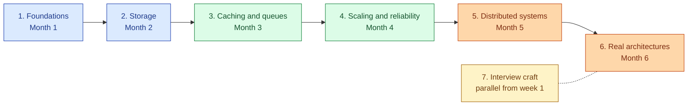
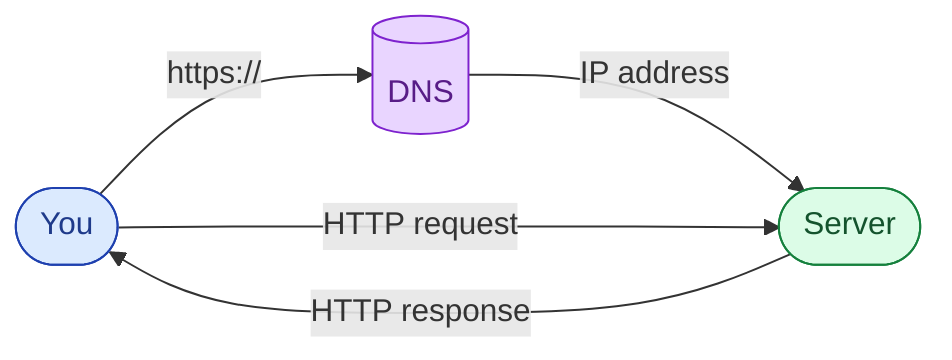
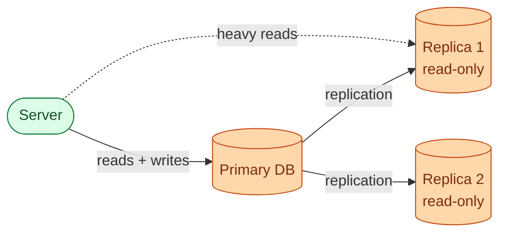
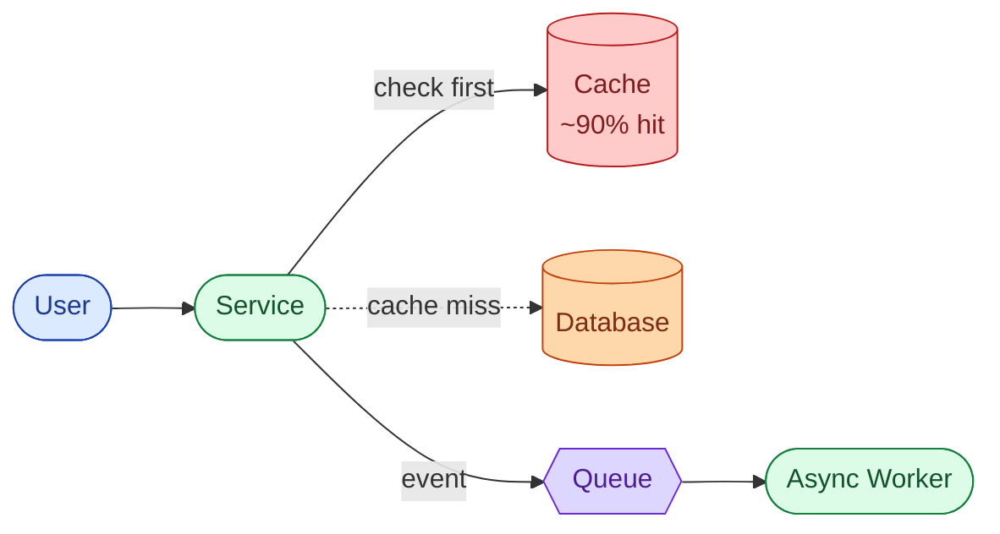
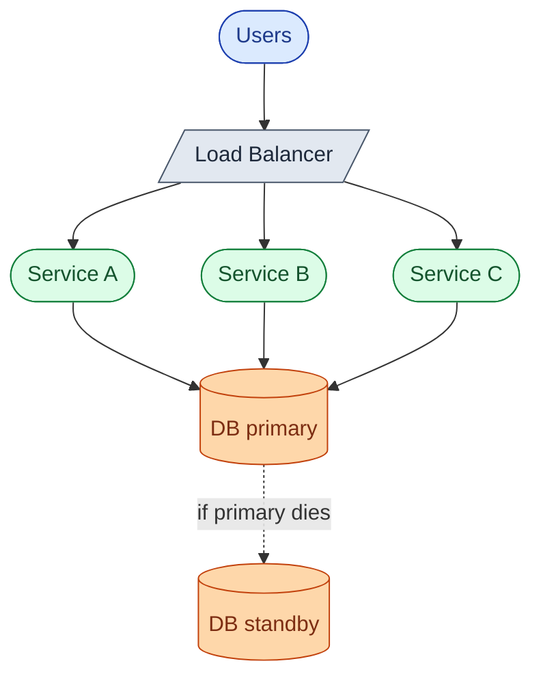
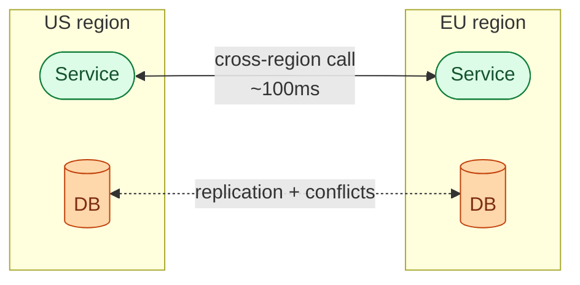
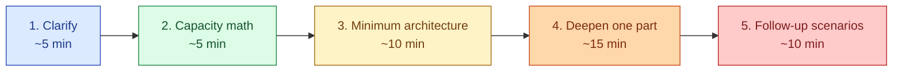
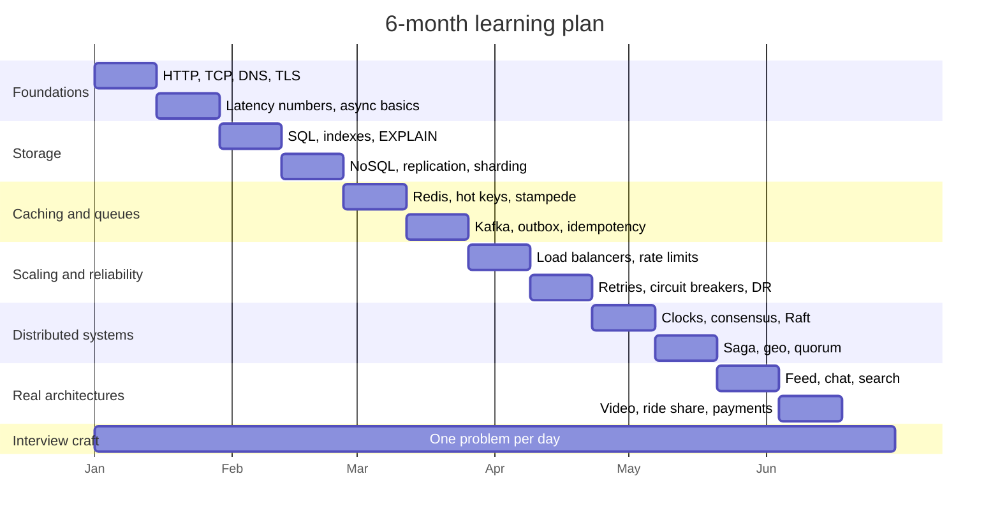

<link rel="stylesheet" href="/assets/css/practice.css">

<section class="pr-hero">
  

    System Design Roadmap
    <h1 class="pr-title">Six months. Seven stages. From basics to designing Instagram on a whiteboard.</h1>
    

      A real, ordered learning path. Each stage builds on the last one. You finish each stage by building something small, not by memorising slides.
    

  

</section>

> **Looking for a single concept?** The [System Design Concepts library](/practice/system-design/concepts/) has short, scenario-driven answers to 70 common questions. Use it as a quick lookup when a stage below mentions something unfamiliar.

## How to read this page

Read top to bottom. Do the stages in order. The order matters more than people think. If you try to learn Kafka before you understand what TCP is, you will get stuck and quit. Most people who fail at system design fail because they skipped the boring basics.

Two paces:

- If you already write code at work, plan on **four months**.
- If you are still learning to code, plan on **eight months**.

Either way, the structure is the same.

---

## The journey, in one picture

Stages 1 to 6 are sequential. Stage 7 runs alongside the whole thing.

---

## What you can do at each level

A quick honesty check. Where are you now, where do you want to be?

| Level | What you can do | What people pay you for |
|-------|-----------------|-------------------------|
| **Junior** | Build a CRUD app. Add a database. Deploy it. | Writing features against an existing design. |
| **Mid** | Add a cache. Add a queue. Read a slow query plan. Recover a backup. | Owning a service end to end. |
| **Senior** | Design a system from scratch. Know when to pick SQL vs NoSQL. Spot the bottleneck before it ships. | Designing systems other engineers will build. |
| **Staff** | Design across multiple teams. Predict failure modes you have never seen. Have an opinion on every trade-off. | Setting direction. Catching the failure mode nobody else sees. |

By the end of Stage 4 you are mid-level. By the end of Stage 6 you are senior. Staff comes from production scars, not from a roadmap.

---

## Stage 1: Foundations

**Goal.** Learn the vocabulary. You cannot design anything if you do not know what a server, a port, or a DNS record actually is.

**The picture in your head.**

**Topics.**

| Group | Topics |
|-------|--------|
| **Networking basics** | What an IP address is. Ports. TCP vs UDP. Why TCP needs a handshake. |
| **The web stack** | DNS. HTTP methods. HTTP status codes. Headers. Why HTTPS is different. |
| **Mental models** | Latency vs throughput. The four nines. Synchronous vs asynchronous. |
| **Useful numbers to memorise** | Memory access: 100ns. SSD read: 100us. Disk seek: 10ms. Cross-region network: 100ms. |
| **API styles** | REST. RPC. gRPC. GraphQL. WebSocket. When each one fits. |

**Build this in week 4.** A tiny HTTP server in any language. Two endpoints: `POST /links` and `GET /:id`. Store data in a JSON file. Deploy it on a free tier (Fly, Render, Railway).

**You are done when** you can look at a cloud architecture diagram and explain every box and every arrow out loud.

---

## Stage 2: Storage and data

**Goal.** Decide where data lives. The biggest single decision in any design.

**The picture in your head.**

**Topics.**

| Group | Topics |
|-------|--------|
| **Relational basics** | Tables, rows, columns. Primary keys. Foreign keys. JOINs. |
| **Indexes** | B-tree indexes. Composite indexes. Reading an EXPLAIN plan. |
| **Transactions** | ACID. Isolation levels. What a deadlock is. Long-running transactions. |
| **NoSQL families** | Key-value (Redis, DynamoDB). Document (MongoDB). Wide-column (Cassandra). Search (Elasticsearch). |
| **Replication** | Leader-follower. Replication lag. Read-your-writes. |
| **Sharding** | Range vs hash sharding. Hot shards. Re-sharding pain. |
| **Consistency models** | Strong. Eventual. Causal. Read-your-writes. |
| **Storage engines** | B-trees vs LSM trees. Why your DB choice changes write speed by 10x. |

**Build this in week 8.** Take your Stage 1 service. Move the JSON file to Postgres. Add one index. Run EXPLAIN on a query and read the plan. Add one slow query that scans the whole table. Watch the latency.

**You are done when** someone asks "should this be SQL or NoSQL?" and your answer is a list of follow-up questions, not a guess.

---

## Stage 3: Caching, queues, and async work

**Goal.** Make things fast. Decouple the slow parts.

**The picture in your head.**

**Topics.**

| Group | Topics |
|-------|--------|
| **Where caches live** | Browser. CDN. In-process. Distributed (Redis, Memcached). |
| **Cache strategies** | Read-through, write-through, write-behind, cache-aside. |
| **Eviction** | LRU, LFU, TTL. Why hit rate depends on this more than size. |
| **The hard part** | Cache invalidation. Hot keys. Thundering herd. Request coalescing. |
| **Queues vs streams** | SQS-style queue (one consumer). Kafka-style stream (many). |
| **Delivery guarantees** | At-most-once, at-least-once, exactly-once. Why exactly-once is a lie. |
| **Idempotency** | Idempotency keys. Dedup. Why every retry-safe endpoint needs them. |
| **Patterns** | Outbox pattern. CDC (change data capture). Dead letter queue. Backpressure. |

**Build this in week 12.** Add Redis in front of Postgres. Measure the hit rate. Add Kafka or NATS. Move click-counting out of the request path into a background consumer.

**You are done when** you can draw a system where a write happens, an event is published, and three downstream services react without the original write caring.

---

## Stage 4: Scaling and reliability

**Goal.** Survive growth and survive failure. These are the same conversation.

**The picture in your head.**

**Topics.**

| Group | Topics |
|-------|--------|
| **Scaling shapes** | Vertical vs horizontal. Stateless vs stateful. Why the database is the hard part. |
| **Load balancers** | L4 vs L7. Round-robin, least-connections, IP-hash, consistent-hash. Health checks. |
| **Rate limiting** | Token bucket. Sliding window. Per-user, per-IP, per-endpoint. |
| **Failure handling** | Timeouts. Retries with backoff. Jitter. Circuit breakers. Bulkheads. |
| **Graceful degradation** | What you serve when the recommendations engine is down. What you never compromise on. |
| **Capacity planning** | Auto-scaling. Connection pools. Headroom. |
| **Disaster recovery** | RTO, RPO. Backups vs replicas. Region failover. Blast radius. |

**Build this in week 16.** Put your service behind a load balancer. Run two copies. Kill one mid-request and watch what happens. Add a rate limiter on `POST /links`. Add a timeout and a retry on the cache call.

**You are done when** you can take any system and answer "what happens if X dies?" for every box in the diagram.

---

## Stage 5: Distributed systems hard parts

**Goal.** Understand the genuinely subtle problems. This is where senior separates from mid.

**The picture in your head.**

**Topics.**

| Group | Topics |
|-------|--------|
| **Clocks lie** | Why machines disagree about time. Lamport timestamps. Vector clocks. Hybrid logical clocks. |
| **Consensus** | What consensus actually means. Paxos (the idea). Raft (the readable version). Why most teams use etcd or ZooKeeper. |
| **Leader election** | How a cluster picks a leader. Split-brain. The brief window without one. |
| **Coordination** | Distributed locks. Why most "use a distributed lock" answers are wrong. When they are right. |
| **Transactions across services** | Two-phase commit (and why nobody uses it). Saga pattern. Compensating actions. |
| **Quorum** | N, R, W. Why R + W > N gives strong consistency. The availability cost. |
| **Strong models** | Linearizability. Serializability. Why they are not the same. |
| **Geo** | Data residency (GDPR forces this). Active-active vs active-passive. Follow-the-sun. |

**Build this in week 20.** Set up Postgres replication with one primary and one replica. Force a failover. Time it. Read the Raft paper (the short one). Implement a tiny leader-election with three nodes using Redis (then realise why this is a bad idea, and remember that).

**You are done when** every system design answer you give ends with "and here is the trade-off I am accepting."

---

## Stage 6: Real architectures

**Goal.** Patterns that show up across many real products. Once you know the parts, the same shapes appear over and over.

**Architectures to study.**

| Architecture | What stresses the design | Where it lives in the real world |
|--------------|--------------------------|----------------------------------|
| **News feed** | Push vs pull fan-out. Celebrity problem. | Twitter, Instagram, LinkedIn. |
| **Real-time chat** | WebSockets. Presence. Ordering. Mobile reconnect. | WhatsApp, Slack, Discord. |
| **Search** | Inverted index. Ranking. Typo tolerance. | Google, Algolia, Elasticsearch. |
| **Recommendations** | Online serving (not training). Cold-start. | Spotify, Netflix, TikTok. |
| **Video streaming** | Transcoding ladder. Adaptive bitrate. CDN. | YouTube, Netflix, Twitch. |
| **Ride sharing** | Real-time location. Matching. State machine. | Uber, Lyft, Bolt. |
| **Payments** | Idempotency. Reconciliation. PCI scope. | Stripe, Adyen, every bank. |
| **Notifications** | Fan-out. Channel routing. Quiet hours. Retries. | Push notifications, email blasts. |
| **Approval workflows** | State machine. Role resolution. Audit. | Workday, ServiceNow, Jira. |

**Cross-cutting patterns.**

| Pattern | When it earns its complexity |
|---------|------------------------------|
| **API gateway** | Always, once you have more than two services. |
| **Service mesh (Istio, Linkerd)** | Rarely. Only if you have 50+ services and a platform team. |
| **CQRS** | When read and write paths look completely different. |
| **Event sourcing** | When you need to replay history. Audit, finance, debugging. |
| **Strangler fig** | When you are replacing a legacy system. The only safe way to do it. |

**Build this in month 5-6.** Pick three products you use every day. Sketch their architecture before you research. Then research. Then compare. The gap between your guess and reality is the lesson.

**You are done when** you can look at any product and sketch the high-level architecture from memory.

---

## Stage 7: Interview craft (running in parallel from week 1)

**Goal.** Win the interview, not just know the material.

**The five moves of a system design interview.**

**Topics.**

| Group | Topics |
|-------|--------|
| **Opening moves** | The five clarifying questions that change every design. Naming the constraints out loud. |
| **Capacity math** | Requests per second. Storage per year. Bandwidth at peak. Practice until 90 seconds. |
| **Drawing** | Rectangle = service. Cylinder = data store. Hexagon = queue. Label every arrow. |
| **Decisions out loud** | Options, trade-offs, your pick. Say all three. |
| **Going deep** | Pick the part you know best when asked. Never the part the interviewer just asked about. |
| **Common traps** | Over-engineering from minute one. Forgetting auth. Forgetting rate limiting. Forgetting GDPR. |
| **Handling "I do not know"** | "I am not certain, but my best guess is X because Y." Better than confident bluffing. |

**Practice every day.** Pick one of the [practice problems on this track](/practice/system-design/). Read the question. Write your answer in a doc. Then read the solution. Compare. Repeat.

**You are done when** you can walk into any senior-level interview and finish with the interviewer convinced you have been doing this for years.

---

## The full topic matrix

If you want a single page to scan and check off, this is it.

| Area | Stage 1 | Stage 2 | Stage 3 | Stage 4 | Stage 5 | Stage 6 |
|------|---------|---------|---------|---------|---------|---------|
| **Networking** | HTTP, TCP, DNS, TLS | | | TLS termination | Cross-region latency | |
| **Data** | | SQL, NoSQL, indexes, ACID, replication, sharding | | | Quorum, consistency models | |
| **Caching** | | | Redis, CDN, eviction, hot keys | | | |
| **Messaging** | | | Kafka, SQS, outbox, CDC, dedup | | | |
| **Scale** | Latency vs throughput | | | LB, auto-scale, rate limit | | |
| **Reliability** | | | | Retries, circuit breakers, DR | Leader election, failover | |
| **Distributed** | | | | | Clocks, consensus, Raft, Saga | Geo, multi-region |
| **Patterns** | | | | | | API gateway, CQRS, ES |
| **Architectures** | | | | | | Feed, chat, search, video |
| **Interview** | Clarifying questions | Math | Drawing | Going deep | Follow-ups | Trade-offs |

Every cell that is empty is intentional. Those topics belong to a later stage. Do not jump.

---

## The 6-month plan, week by week

Same plan as a table.

| Month | Stage | Focus | Build by the end |
|-------|-------|-------|------------------|
| **1** | Foundations | HTTP, TCP, DNS, TLS, latency numbers, API styles. | A tiny HTTP server with two endpoints, deployed to a free tier. |
| **2** | Storage | SQL, indexes, transactions, replication, sharding. | Move your data to Postgres. Read an EXPLAIN plan. |
| **3** | Caching and async | Redis, eviction, hot keys, Kafka, idempotency. | Add Redis and Kafka. Measure cache hit rate. |
| **4** | Scaling and reliability | Load balancers, retries, circuit breakers, DR. | Run two copies behind a LB. Kill one and watch. |
| **5** | Distributed systems | Consensus, leader election, Saga, geo. | Force a Postgres failover. Time it. |
| **6** | Real architectures + interview practice | Feed, chat, search, video, payments. | One practice problem per day. Compare to the solution. |

Block one hour every morning. That is enough. Two hours is better. Three hours and you burn out.

---

## A short note before you start

Nobody learns system design by reading. You learn it by drawing, building, breaking, and fixing. The roadmap is the map of the territory, not the territory.

The territory is everything that lives in production. Go build something small. Break it on purpose. Then fix it.

When you come back here, the [practice problems](/practice/system-design/) are the exam. Use them.
